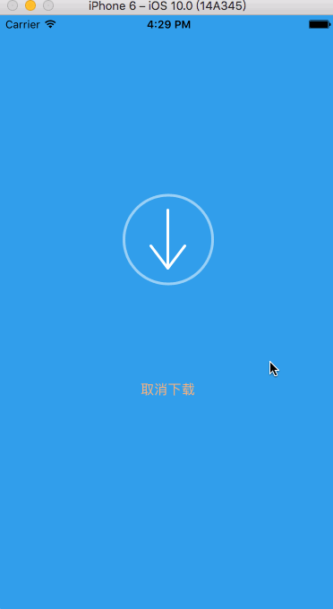
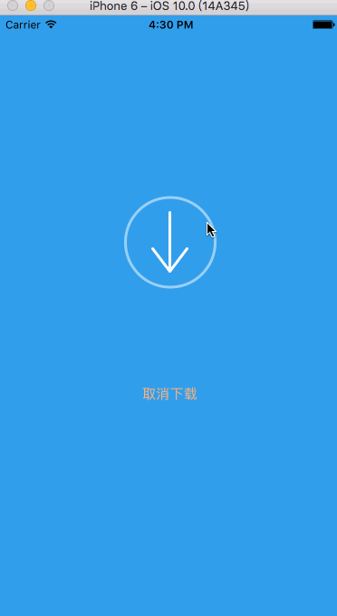

# ASDownloadAnimationView
Reference JSDownloadView author encapsulation, realize the same function of library to try

<html>
<body>
<h2>what's ASDownloadAnimationView ?</h2>

The View of combining animation show the download progress

Reference JSDownloadView author encapsulation, realize the same function of library to try 

JSJSDownloadView learning link：https://github.com/Josin22/JSDownloadView

<h2>Renderings show : download successful</h2>

<h2>Renderings show : download failed</h2>

<h2>Method of use</h2>

just in the demo

</body>

</html>